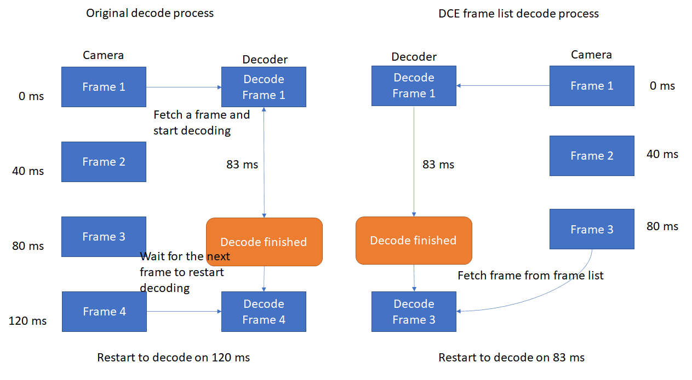

# Overview

## Overview of Dynamsoft Camera Enhancer

Dynamsoft Camera Enhancer (DCE) is a multifunctional SDK specially designed for improving video stream decoding. With the help of DCE, users can set up camera modules with just a few lines of code in their mobile projects. In the meanwhile, users can find all kinds of camera control and video stream process APIs to improve the performance of the camera module.

## Main features

1. Frame list

    DCE frame list reduces waiting time on decoding. Normally, when a decoder finishes decoding on the current frame, it has to acquire a new frame from the camera. Limited by the frame rate of the camera, this process will take a little time. However, If DCE is activated, instead of waiting for the new frames from the camera, decoders can fetch frames from the DCE frame list directly. Further, the DCE frame list also helps when the decoder is blocked on decoding a certain frame. The decoder will restart the decoding process and fetch a new frame from the frame list immediately when the frame list is filled up.

    

        

        
DCE frame list

    

2. Fast mode

    DCE fast mode can reduce the time consumption on decoding. In the fast mode, DCE will cut frames into small pieces. This process largely reduces the scan area size for decoders, which sharply decreases the decoding time consumption.

3. Frame filter

    DCE frame filter will discard the blurry frames before decoders start decoding on the video stream. If frame filter is enabled, the filtered frames will be stored in the DCE frame list for further decode process.

4. Camera Control

    DCE is a highly completed camera module that provides a series of camera control APIs that help users on making personalized settings. The camera control APIs include focus control, zoom control, and other basic camera control.

## Programming language

Dynamsoft Camera Enhancer is now available for the following programming languages:

- Java (Android)
- Objective-C & Swift (iOS)

## User Scenarios

## About this documentation

This documentation aims at helping you on learning, understanding, and using Dynamsoft Camera Enhancer. In this documentation, you can find useful information that guides you step by step from installation to further development.

## Quick links

- [Get and set up license]({{site.introduction-license}}License.html)
- [Programming guides]({{site.programming}})
- [Get help on debugging]({{site.trouble-shooting}})
- [Contact us]({{site.contact-us}})
