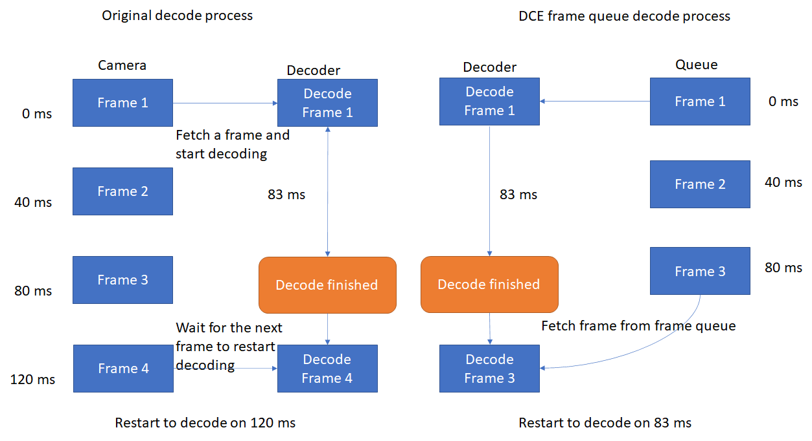

# Overview of Dynamsoft Camera Enhancer

Dynamsoft Camera Enhancer (DCE) is a software development kit (SDK) specially designed to enhance the quality of video frames produced by USB connected or mobile cameras. Applications that need to capture frames or read these frames to obtain barcodes or text, etc. can work faster and more efficiently due to the enhancement of the frames. Read on to learn more about the features of the SDK, which makes everything possible.

## Main features

1. **Video Frame Queue**

    DCE frame queue is the key feature that speeds up frame acquisition. It also acts as the administrator that taking over the video frames processed by other DCE functions. The main responsibility of the DCE frame queue is to:
    - Take over all the processed video frames.
    - Temporarily store the video frames.
    - Enable the application to fetch frames immediately.
    - Optimize the timing out system.

    DCE frame queue reduces the waiting time on fetching frames. For example, in the barcode decoding process, when a decoder finishes decoding on the current frame, it has to acquire a new frame from the camera. Limited by the frame rate of the camera, this process will take a little time. However, If DCE is activated, instead of waiting for the new frames from the camera, decoders can fetch frames from the queue directly.

    

        

        
How Frame Queue speed up barcode decoding

    

    DCE frame queue also provides a new solution on timing out. Users can end the current process immediately when the queue is filled up. This setting can prevent the application from consuming too much time processing the knotty frames.

2. **Frame Filtering**

    Frame filter is designed to filter out high-quality frames and save them in the frame queue for further usage. What DCE frame filter do is to:

    - Discard all the frames if the device is detected to be shaking.
    - Make sharpness evaluations on each frame to filter out high-quality frames.

    Sensor filter is available for mobile devices and in the meanwhile, frame sharpness filter can be enabled on all kinds of devices. By making restrictions on video frame sources can prevent the applications from processing the blurry frame and improve the working efficiency and accuracy.

3. **Consecutive Frame Cropping**

    The pattern in which we process frames so that we only add certain areas to the frame queue. We call this pattern "**Fast mode**" because it sharply reduces the scan area and results in faster processing speed. If the fast mode is enabled, frames will be cropped in four different cropping methods and they will be implemented periodically.

    

        

        
How fast mode is cropping frames

    

4. **Auto Focus**

    For the low-end cameras, DCE enables users to make autofocus settings on controlling the camera proactively so that we don't stay on the blurry frames. Other focus settings are also available for users to deploy more personalized and advanced camera focus settings.

5. **Auto Zoom**

    When DCE is used with the barcode reader, we can use the certain feature of the barcode reader to predetermine the area of interest and zoom in to get a better frame on barcode decoding. Autozoom mode will be activated if the barcode reader detected a barcode area but failed on decoding. The zoom factor will be reset if the barcode is decoded successfully.

6. **Regular Camera Control**

    Last but not least, we incorporated camera control APIs in the SDK. The benefits of these APIs are:
    - Enable users to add camera functionality with a few lines of code
    - Unified experience on iOS/Android

With these features, users can easily integrate the camera and enable certain features when required so that the rest of the application logic can get high-quality images to process which results in:

- Speed up on barcode or text reading.
- Less misreading rate.
- More convenient timing out system
- High standard camera control.

## Usage Scenarios

- Long-distance decoding

    With the help of DCE, users no longer need to manually approach the barcode area when decoding on the barcode that far from the camera. When a barcode area is found but failed to be decoded, DCE enables the camera to zoom in to the barcode area automatically. Once the barcode is decoded successfully, the zoom factor will be restored to the default value.

- Continuous barcode decoding

    No matter the users are decoding on the single barcode or trying to decode continuously, DCE can be the best choice to accelerate the barcode decoding process. In continuous barcode decoding works, the DCE frame queue is taking over the frame source for the decoder instead of the camera. The decode restart time and timeout mechanism are greatly promoted and the total time consumption on continuous decoding is sharply reduced.

- Low-end devices

    Bounded up with camera performance, it is always a huge challenge for camera-related applications to perform well on old devices. DCE is breaking through these hardware issues by enabling high-standard autofocus and frame filter functions. DCE focus APIs enable users to apply high-standard focus settings which help the devices to capture higher standard images. In the meanwhile, the frame filter pattern of DCE enables the application to skip processing the low-quality frames.

## Programming language

Dynamsoft Camera Enhancer is now available for the following programming languages:

- Java (Android)
- Objective-C & Swift (iOS)
