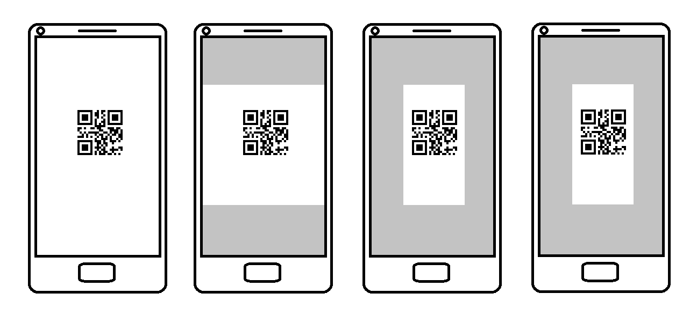

# Overview of Dynamsoft Camera Enhancer

Dynamsoft Camera Enhancer (DCE) is an SDK specially designed to enhance the frame acquisition process from a camera.
DCE enables users to easily deploy camera modules in all kinds of video stream processing applications. This camera module includes high-level video frame preprocessing algorithms and multifunctional camera controlling APIs, which empower the application to focus on processing high-quality frames. Therefore, the processing efficiency and accuracy of the applications are intensely improved.

## Main features

### **Video Frame Queue**

DCE frame queue is the key feature that speeds up frame acquisition. It also acts as the administrator that takes over the video frames processed by other DCE functions. The main responsibilities of the DCE frame queue are to:

- Temporarily store the filtered and cropped video frames.
- Transfer a new frame immediately when the application finishes the processing of the current frame.
- Enable the applications to skip the time-consuming frames to release the occupancy of computation resources.

When DCE is embedded in an application, the video frames will be preprocessed and temporarily saved in the DCE frame queue. Each time when the application completed the current process, instead of waiting for the camera to transfer a new frame, the application can fetch a new frame from the frame queue immediately. In addition, the frame queue also provides a new solution on the timing out system. By monitoring and controlling the number of frames in the queue, users can enable the application to abandon the current processing frame and restart the scan. The frame queue sharply reduces the lag in the scanning process and it will finally result in a stable and fluent user experience.

### **Frame Filtering**

Frame filter is designed to make sharpness filters on frames and temporarily save the high-sharpness frames in the frame queue for further usage. What DCE frame filter do is to:

- Enable sensor filter on mobile devices.
- Enable frame sharpness on all devices.
- Discard all the frames if the device is detected to be shaking.
- Make sharpness evaluations on each frame to filter out high-quality frames.

By making restrictions on video frame sources can prevent the applications from processing the blurry frame and improve the working efficiency and accuracy.

### **Frame Cropping**

**Fast mode** is the pattern in which we process frames so that we only add certain areas to the frame queue. We call this pattern `Fast mode` because it sharply reduces the scan area and results in faster processing speed. If the fast mode is enabled, frames will be cropped in four different cropping methods and they will be implemented periodically.

    

    
How fast mode is cropping frames

### **Auto Focus**

For the low-end cameras, DCE enables users to make autofocus settings on controlling the camera proactively so that we will not stay on the blurry frames. Other focus settings are also available for users to deploy more personalized and advanced camera focus settings.

### **Auto Zoom**

If the barcode reader is enabled at the same time when DCE is working, we can use the intermediate result of the barcode reader to predetermine the area of interest. DCE will let the camera zoom in to approach the interest area on the occasion that the system did not receive the final result but the intermediate result is available. The zoom factor will be reset if the application decodes on the barcode successfully.

### **Regular Camera Control**

Last but not least, we incorporated camera control APIs in the SDK. The benefits of these APIs are:
- Enable users to add camera functionality with a few lines of code
- Unified experience on iOS/Android

With these features, users can easily integrate the camera and enable certain features when required so that the rest of the application logic can get high-quality images to process, which results in:

- Speed up on barcode or text reading.
- Less misreading rate.
- More convenient timing out system
- High standard camera control.

## Usage Scenarios

### Long-distance decoding

With the help of DCE, users no longer need to manually approach the barcode area when decoding on the barcode that far from the camera. When a barcode area is found but failed to be decoded, DCE enables the camera to zoom in to the barcode area automatically. Once the barcode is decoded successfully, the zoom factor will be restored to the default value.

### Continuous barcode decoding

In traditional scan modes, the scanning process are always intermittent because the scanner can’t continue the scan process before it receives a new frame from the camera. DCE frame queue tried to make this intermittent process continuous. The frame queue takes over and saves the new frames captured during the time that the scanner is processing on the former frame. Immediately when the former frame is processed, the scanner will fetch the newest frame in the queue and restart the scanning process. These behaviors will make the scanning experience of the application more fluent and stable.

### Low-end devices

Bounded up with camera performance, it is always a huge challenge for camera-related applications to perform well on low-end devices. DCE is breaking through these hardware issues by enabling high-standard autofocus and frame filter functions. DCE focus APIs enable users to apply high-standard focus settings, which help the devices to capture higher standard images. In the meanwhile, the frame filter pattern of DCE enables the application to skip processing the low-quality frames.

## Programming language

Dynamsoft Camera Enhancer is now available for the following programming languages:

- Java (Android)
- Objective-C & Swift (iOS)
