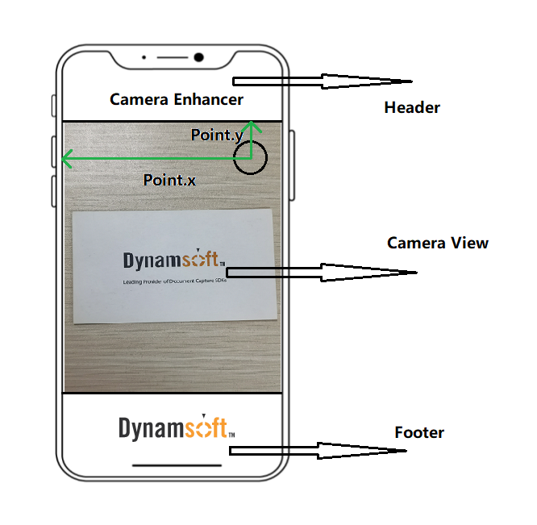

# DCECameraView

The camera view is the main UI view of the DCE SDK. It is designed to display the video preview, overlay, viewfinder, etc.

```java
class com.dynamsoft.dce.DCECameraView extends RelativeLayout
```

| Method Name | Description |
|------|------|
| [`DCECameraView`](#dcecameraview) | Initialize the `DCECameraView` object. |
| [`setOverlayVisible`](#setoverlayvisible) | This method controls whether the camera view to display coloured and translucent overlay. |
| [`getOverlayVisible`](#getoverlayvisible) | Get the visibility (true: visible/ false: invisible) of the overlay. |
| [`setOverlayColour`](#setoverlaycolour) | Set the stroke and fill colour of the overlay. |
| [`setViewfinderVisible`](#setviewfindervisible) | This method controls whether to display a viewfinder. |
| [`getViewfinderVisible`](#getviewfindervisible) | Get the visibility (true: visible/ false: invisible) of the viewfinder. |
| [`setViewfinder`](#setviewfinder) | Set the position and the size of the viewfinder. |
| [`setTorchButton`](#settorchbutton) | Set the position of the torch button. The visibility of the torch button will be set to true as well. |
| [`setTorchButtonVisible`](#settorchbuttonvisible) | Set the visibility of the torch button. The torch button icon is pre-set in the SDK. |
| [`getTorchButtonVisible`](#gettorchbuttonvisible) | Get the visibility setting of the torch button. When it returns true, a torch button should be displayed on the screen. |

&nbsp;

## DCECameraView

Initialize the `DCECameraView` object.

```java
DCECameraView(android.content.Context context)
```

**Parameters**

`context`: An instance of global information about an application environment.

&nbsp;

## setOverlayVisible

This method controls whether the camera view displays coloured and translucent overlays.

```java
void setOverlayVisible(boolean overlayVisibile)
```

**Parameters**

`overlayVisibile`: If true, the camera view will draw and display overlays according to the position and colour settings. Otherwise, the overlay will be hidden.

**Code Snippet**

```java
//Suppose dceCameraView is an object of `DCECameraView`
dceCameraView.setOverlayVisible(true);
```

&nbsp;

## getOverlayVisible

Get the visibility (true: visible/ false: invisible) of the overlay.

```java
boolean getOverlayVisible()
```

**Return Value**

The visibility (true: visible/ false: invisible) of the overlay.

**Code Snippet**

```java
//Suppose dceCameraView is an object of `DCECameraView`
boolean isVisible = dceCameraView.getOverlayVisible();
```

&nbsp;

## setOverlayColour

Set the stroke and fill colour of the overlays.

```java
void setOverlayColour(int strokeARGB, int fillARGB)
```

**Parameters**

`strokeARGB`: The colour code of the overlays stroke.
`fillARGB`: The colour code of the overlays stroke.

**Code Snippet**

```java
//Suppose dceCameraView is an object of `DCECameraView`
dceCameraView.setOverlayColour(0xff00ff00, 0x00000000);
```

&nbsp;

## setViewfinderVisible

This method controls whether to display a viewfinder.

```java
void setViewfinderVisible(boolean viewfinderVisible)
```

**Parameters**

`viewfinderVisible`: A boolean value that means whether the viewfinder is visible or not. Users can define the position and size of the viewfinder via method [`setViewfinder`](#setviewfinder). The viewfinder will be created based on the default value if the `setViewfinder` has never been triggered.

**Code Snippet**

```java
//Suppose dceCameraView is an object of `DCECameraView`
dceCameraView.setViewfinderVisible(true);
```

&nbsp;

## getViewfinderVisible

Get the visibility (true: visible/ false: invisible) of the viewfinder.

**Return Value**

A boolean value means whether the viewfinder is visible.

**Code Snippet**

```java
//Suppose dceCameraView is an object of `DCECameraView`
boolean flag = dceCameraView.getViewfinderVisible();
```

&nbsp;

## setViewfinder

Set the position and the size of the viewfinder.

```java
void setViewfinder(float left, float top, float right, float bottom) throws CameraEnhancerException
```

**Parameters**

`left`: The distance (by percentage) between the left border of the viewfinder and the left side of the screen. The default value is 0.15.  
`top`: The distance (by percentage) between the top border of the viewfinder and the top side of the screen. The default value is 0.3.  
`right`: The distance (by percentage) between the right border of the viewfinder and the left side of the screen. The default value is 0.85.  
`bottom`: The distance (by percentage) between the bottom border of the viewfinder and the top side of the screen. The default value is 0.7.

**Code Snippet**

```java
//Suppose dceCameraView is an object of `DCECameraView`
dceCameraView.setViewfinder(0.2, 0.3, 0.8, 0.7);
```

**Remarks**

The viewfinder is built based on the screen coordinate system. The origin of the coordinate is the left-top point of the mobile device. The `left border` of the viewfinder always means the closest border that parallels to the left side of the mobile device no matter how the mobile device is rotated.

&nbsp;

## setTorchButton

Set the position of the torch button. The visibility of the torch button will be set to true as well.

```java
void setTorchButton(Point torchButtonPosition)
```

**Parameter**

`torchButtonPosition`: The `torchButtonPosition` illustrates the coordinates of the torch button on the camera view. The x coordinate of the point stands for the pixel distance between the point and the left edge of the screen. The y coordinate of the point stands for the pixel distance between the point and the top edge of the screen.

<div align="center"> 
    <p></p>
    <p><b>torchButtonPosition</b> is the position on the <b>camera view</b></p>
</div>

**Code Snippet**

```java
Point torchButtonPosition = new Point();
torchButtonPosition.x = 100;
torchButtonPosition.y = 100;
dceCameraView.setTorchButtonPosition(torchButtonPosition);
```

&nbsp;

## setTorchButtonVisible

Set the visibility of the torch button. The torch button icon is preset in the SDK. If the `torchButtonPosition` has never been configured, the `torchButton` will be displayed on the default position. Currently, the icon and the size of the button are not available for setting.

```java
void setTorchButtonVisible(boolean isTorchButtonVisible)
```

**Parameter**

`isTorchButtonVisible`: When the value is true, the torch button should be displayed. Otherwise, the torch button should be hidden.

**Code Snippet**

```java
dceCameraView.setTorchButtonVisible(true);
```

&nbsp;

## getTorchButtonVisible

Get the visibility setting of the torch button. When it returns true, a torch button should be displayed on the screen.

```java
Boolean getTorchButtonVisible()
```

**Return Value**

A boolean value. When the value is true, the torch button should be displayed. Otherwise, the torch button should be hidden.

**Code Snippet**

```java
Boolean isTorchButtonVisible = dceCameraView.getTorchButtonVisible();
```
