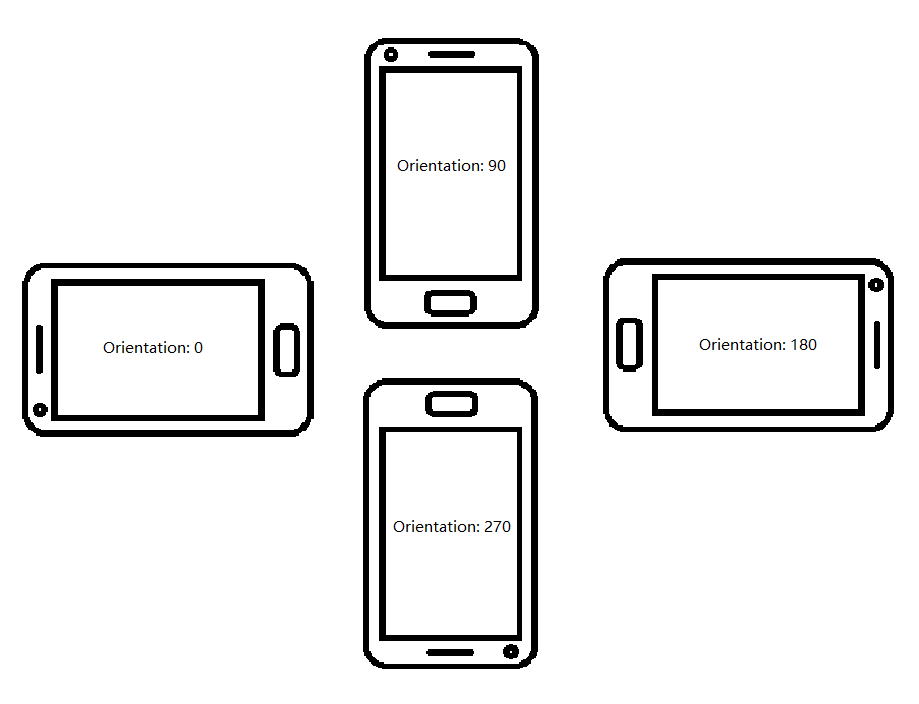

# Frame

This page is for `Frame` Class. `Frame` parameters store the frame data.

```Java
class com.dynamsoft.dce.Frame
```

| Method Name | Type |
| ----------- | ---- |
| [`getImageData`](#getimagedata) | byte[] |
| [`getWidth`](#getwidth) | int |
| [`getHeight`](#getheight) | int |
| [`getStrides`](#getstrides) | int[] |
| [`getPixelFormat`](#getpixelformat) | int |
| [`getFrameID`](#getframeid) | int |
| [`getQuality`](#getquality) | [`EnumFrameQuality`]({{site.barcode-enum}}enum-frame-quality.html) |
| [`getIsCropped`](#getiscropped) | boolean |
| [`getCropRegion`](#getcropregion) | Rect |
| [`getOrientation`](#setorientation) | int |
| [`setImageData`](#setimagedata) | byte[] |
| [`setWidth`](#setwidth) | int |
| [`setHeight`](#setheight) | int |
| [`setStrides`](#setstrides) | int[] |
| [`setPixelFormat`](#setpixelformat) | int |
| [`setFrameID`](#setframeid) | int |
| [`setQuality`](#setquality) | [`EnumFrameQuality`]({{site.barcode-enum}}enum-frame-quality.html) |
| [`setIsCropped`](#setiscropped) | boolean |
| [`setCropRegion`](#setcropregion) | Rect |
| [`setOrientation`](#setorientation) | int |

## getImageData

Get the pixel data of the image.

```java
byte[] getImageData()
```

**Return Value**

The method returns a byte list that stores the pixel data of the image.

## getWidth

Get the pixel width of the image.

```java
int getWidth()
```

**Return Value**

The method returns the pixel length of the image.

## getHeight

Get the pixel height of the image.

```java
int getHeight()
```

**Return Value**

The method returns the pixel height of the image.

## getStrides

Get the stride of the image by the Y (luminance) component.

```java
int getHeight()
```

**Return Value**

The method returns the YUV components value of the image.

**Remarks**

`strides[0]` is the Y component of the image which equals the stride of the image. `strides[1]` and `strides[2]` are the U (blue projection) and V (red projection) components of the image.

## getPixelFormat

Get the pixel format of the image. Currently, the image output format of `DCEFrame` is always NV21.

```java
int setPixelFormat()
```

**Return Value**

The method returns an int value that refers to the enumeration value of [`ImagePixelFormat`]({{site.barcode-enum}}other-enums.html#imagepixelformat) (view the enumeration members in Dynamsoft Barcode Reader documents).

## getFrameID

Get the `frameID` of the `DCEFrame` object.

```java
int setFrameID()
```

**Return Value**

The method returns an int value that stores the `frameID` of the image.

## getQuality

Get the frame quality of the image. User have to enable the frame filter feature to get the quality (high/low) of the image. Otherwise, the frame quality will be unknown.

```java
EnumFrameQuality setQuality()
```

**Return Value**

The method returns an enumeration value in [`EnumFrameQuality`]({{site.barcode-enum}}enum-frame-quality.html).

**Remarks**

Users can get all the original DCEFrame via `DCEFrameListener` but only high-quality frame can be acquired from the DCE video buffer if frame filter is enabled. In another word, when frame filter feature is enabled, the frame quality will always be high if they are acquired by triggering `getFrameFromBuffer`.

## getIsCropped

Get a boolean value that means whether the image is cropped. The frames can be cropped if `fast mode` is enabled.

```java
boolean getIsCropped()
```

**Return Value**

A boolean value. `True` means the image is cropped and `false` means the image has never been cropped.

## getCropRegion

Get the crop region of the image (if the image is cropped).

```java
Rect getCropRegion()
```

**Return Value**

A Rect value that stores the crop region. If the image is not cropped, the value will be null.

## getOrientation

Set the orientation of the image.

```java
int getOrientation()
```

**Return Value**

Int value that means the rotation angle of the image. The value is 0, 90, 180 or 270 with depends on the device orientation.

<div align="center">
    <p></p>
    <p>All examples of the orientation</p>
</div>

## setImageData

Set the pixel data of the image.

```java
void setImageData(byte[] imageData)
```

**Parameters**

`imageData`: A byte list that storing the image pixel data.

## setWidth

Set the pixel width of the image.

```java
void setWidth(int width)
```

**Parameters**

`width`: The pixel value that stands for the width of the image.

## setHeight

Set the pixel height of the image.

```java
void setHeight(int height)
```

**Parameters**

`height`: The pixel value that stands for the height of the image.

## setStrides

Set the pixel stride length of the image.

```java
void setStrides(int[] strides)
```

**Parameters**

`strides`: The pixel values that stand for the strides of the image.

## setPixelFormat

Set the pixel format of the image.

```java
void setPixelFormat(int pixelFormat)
```

**Parameters**

`pixelFormat`: The pixelFormat of the image. View more in Dynamsoft Barcode Reader Enumeration [`ImagePixelFormat`]({{site.barcode-enum}}other-enums.html#imagepixelformat)

## setFrameID

Set the `frameID` of the image.

```java
void setFrameID(int frameID)
```

**Parameters**

`frameID`: An int value that stands for the `frameID` of the image.

## setQuality

Set the frame quality of the image.

```java
void setQuality(EnumFrameQuality quality)
```

**Parameters**

`quality`: An `Enumeration` value that means the frame quality. Read more in `EnumFrameQuality`.

## setIsCropped

Set whether the image is cropped.

```java
void setIsCropped(boolean isCropped)
```

**Parameters**

`isCropped`: A boolean value that means whether the image is cropped.

## setCropRegion

Set the crop region of the image (if the frame is cropped).

```java
void setCropRegion(Rect region)
```

**Parameters**

`cropRegion`: A Rect value that means crop area of the image (if the frame is cropped).

## setOrientation

Set the orientation of the image.

```java
void setOrientation(int orientation)
```

**Parameters**

`orientation`: Int value that means the rotation angle of the image.
