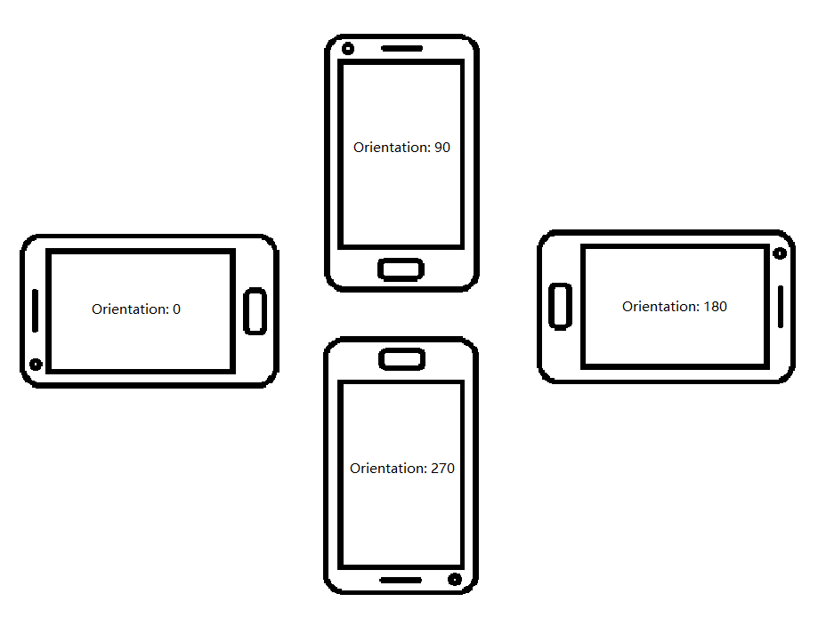

# DCEFrame

Return the frame decode results and additional information.

```objc
@interface DCEFrame : NSObject
```

| Attribute Name | Type |
|------|------|
| [`imageData`](#imagedata) | *NSData* * |
| [`width`](#width) | *NSInteger* |
| [`height`](#height) | *NSInteger* |
| [`stride`](#stride) | *NSInteger* |
| [`pixelFormat`](#pixelformat) | *NSInteger* |
| [`frameID`](#frameid) | *NSInteger* |
| [`quality`](#quality) | [`EnumFrameQuality`]({{site.barcode-enum}}enum-frame-quality.html) |
| [`isCropped`](#iscropped) | *BOOL* |
| [`cropRegion`](#cropregion) | *CGRect* |
| [`orientation`](#orientation) | *NSInteger* |

## imageData

The property stores the pixel data of the image.

```objectivec
NSData* imageData
```

## width

The property stores the pixel width of the image.

```objectivec
NSInteger width
```

## height

The property stores the pixel height of the image.

```objectivec
NSInteger height
```

## stride

The property stores the stride of the image.

```objectivec
NSInteger stride
```

## pixelFormat

The property stores the pixel format of the image. The property value is one of the Enumeration value of `ImagePixelFormat`. Currently, the image output formats of `DCEFrame` are NV21 or ARGB_8888.

```objectivec
NSInteger pixelFormat
```

## frameID

The property stores the `frameID` of the frame.

```objectivec
NSInteger frameID
```

## quality

The property stores the quality of the `DCEFrame` image. User have to enable the frame filter feature to get the quality (high/low) of the `DCEFrame`. Otherwise, the frame quality will be unknown. View more about the frame quality in enumeration [`EnumFrameQuality`]({{site.barcode-enum}}enum-frame-quality.html).

```objectivec
EnumFrameQuality quality
```

## isCropped

The property stores a boolean value that recording whether the image is cropped. The frames can be cropped if `fast mode` is enabled. Property value `true` means the image is cropped and `false` means the image has never been cropped.

```objectivec
BOOL isCropped
```

## cropRegion

The property stores a CGRect value that means the crop region of the image (if the image is cropped). If the image is not cropped, the value will be null.

```objectivec
CGRect cropRegion
```

## orientation

The property stores an int value that means the rotation angle of the image. The value is 0, 90, 180 or 270 with depends on the device orientation.

```objectivec
NSInteger orientation
```

<div align="center">
    <p></p>
    <p>All examples of the orientation</p>
</div>
