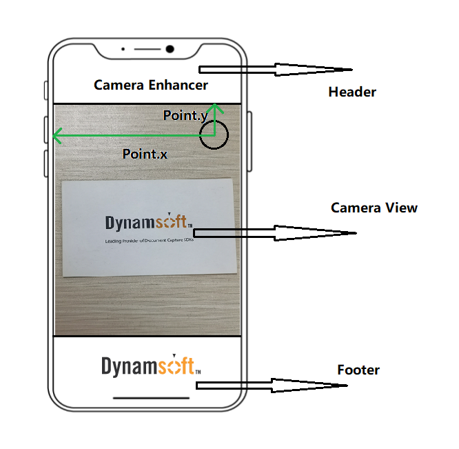

# DCECameraView

`DCECameraView` is the class that enables users to add elements on camera view conveniently.

```objc
@interface DCECameraView: UIView<CALayerDelegate>
```

| Method/Property Name | Description |
| ----------- | ----------- |
| [`initWithFrame`](#initwithframe) | Init the `DCECameraView`. |
| [`captureWithFrame`](#capturewithframe) | Init the `DCECameraView` with a static method. |
| [`overlayVisible`](#overlayvisible) | The property stores the BOOL value that controls the visibility of the overlays. |
| [`setOverlayColour`](#setoverlaycolour) | Set the stroke and fill in colour of the overlay(s). |
| [`viewfinderVisible`](#viewfindervisible) | The property stores the BOOL value that controls the visibility of the viewfinder. |
| [`setViewfinder`](#setviewfinder) | Set the attribute of the viewfinder. Currently only available for position and size setting. |
| [`setViewfinder (with RegionDefinition)`](#setoverlaycolour) | Set the attribute of the viewfinder. Currently only available for position and size setting. |
| [`setTorchButton`](#settorch) |  |
| [`torchButtonVisible`](#torchvisible) |  |

## initWithFrame

Init the DCECameraView.

```objc
- (instancetype)initWithFrame:(CGRect)frame;
```

**Code Snippet**

Objective-C:

```objc
_dceView = [[DCECameraView alloc] initWithView:self.view.bounds]
```

Swift:

```swift
let dceView = DCECameraView.init(frame self.view.bounds)
```

## captureWithFrame

Statically init the DCECameraView.

```objc
+ (instancetype)captureWithFrame:(CGRect)frame NS_SWIFT_NAME(init(frame:));
```

**Code Snippet**

Objective-C:

```objc
_dceView = [DCECameraView cameraWithFrame:self.view.bounds];
```

Swift:

```swift
let dceView = DCECameraView.init(frame self.view.bounds)
```

## overlayVisible

The property stores the BOOL value that controls the visibility of the overlays.

```objc
@property (assign, nonatomic) BOOL overlayVisible;
```

**Remarks**

If the property value is `true`, the `cameraView` will try to draw and display overlays on the interest areas. Otherwise, the `cameraView` will not draw overlays.

**Code Snippet**

Objective-C:

```objc
[_dceView setOverlayVisible:true];
```

Swift:

```swift
dceView.overlayVisible = true
```

## setOverlayColour

Set the stroke and fill in colour of the overlay(s).

```objc
- (void)setOverlayColour:(UIColor*)stroke fill:(UIColor*)fill;
```

**Parameters**

`stroke`: The stroke colour of the overlay.  
`fill`: The fill in colour of the overlay.

**Code Snippet**

Objective-C:

```objc
UIColor* strokeColor = [UIColor colorWithRed:0.1 green:0.2 blue:0.3 alpha:0.5];
UIColor* fillColor = [UIColor colorWithRed:0.1 green:0.2 blue:0.3 alpha:0.5];
[_dceView setOverlayColour:strokeColor fill:fillColor];
```

Swift:

```swift
let strokeColour = UIColor(red: 0.1, green: 0.2, blue: 0.3, alpha: 0.5)
let fillColour = UIColor(red: 0.1, green: 0.2, blue: 0.3, alpha: 0.5)
_dceView = setOverlayColour(strokeColour, fill: fillcolour)
```

## viewfinderVisible

The property stores the BOOL value that controls the visibility of the viewfinder.

```objc
BOOL viewfinderVisible
```

**Remarks**

If the property value is `true`, the `cameraView` will try to create and display a viewfinder. Otherwise, the `cameraView` will not create the viewfinder.

## setViewfinder

Set the attribute of the viewfinder. Currently only available for position and size setting.

```objc
- (void)setViewfinder:(CGFloat)left top:(CGFloat)top right:(CGFloat)right bottom:(CGFloat)bottom;
```

**Parameters**

`left`: The distance (by percentage) between the left border of the viewfinder and the left side of the screen. The default value is 0.15.  
`top`: The distance (by percentage) between the top border of the viewfinder and the top side of the screen. The default value is 0.3.  
`right`: The distance (by percentage) between the right border of the viewfinder and the left side of the screen. The default value is 0.85.  
`bottom`: The distance (by percentage) between the bottom border of the viewfinder and the top side of the screen. The default value is 0.7.

**Code Snippet**

Objective-C:

```objc
[_dceView setViewfinder:0.1 top: 0.3 right: 0.9 bottom: 0.7];
```

Swift:

```swift
_dceView = setViewfinder(0.1, top: 0.3, right: 0.9, bottom: 0.7)
```

**Remarks**

The viewfinder is built based on the screen coordinate system. The origin of the coordinate is the left-top point of the mobile device. The `left border` of the viewfinder always means the closest border that parallels to the left side of the mobile device no matter how the mobile device is rotated.

## setViewfinder (with RegionDefinition)

Set the viewfinder position and size with a [`iRegionDefinition`]({{ site.ios-api-auxiliary }}region-definition.html) value.

```objc
- (void)setViewfinder:(iRegionDefinition)viewfinderRegion error:(NSError * _Nullable)error;
```

**Parameter**

`viewfinderRegion`: Use a [`iRegionDefinition`]({{ site.ios-api-auxiliary }}region-definition.html) value to draw a viewfinder. The parameter will be optimized to the maximum or minimum available value if the input parameter is out of range. For more information, please view [`iRegionDefinition`]({{ site.ios-api-auxiliary }}region-definition.html).

**Code Snippet**

Objective-C:

```objc

```

Swift:

```swift

```

**Remarks**

- The region definition defines the region on the **camera view**. For each value of the class [`iRegionDefinition`]({{ site.ios-api-auxiliary }}region-definition.html):
  - The `regionTop` is the distance between the **top** of the viewfinder and the **top** of the camera view.
  - The `regionBottom` is the distance between the **bottom** of the viewfinder and the **top** of the camera view.
  - The `regionLeft` is the distance between the **left** of the viewfinder and the **left** of the camera view.
  - The `regionRight` is the distance between the **right** of the viewfinder and the **left** of the camera view.

## setTorchButton

Set the position of the torch button. The method determines where shall the torch button be displayed.

```objc
- (void)setTorch:(CGPoint)torchButtonPosition;
```

**Parameter**

`torchButtonPosition`: The `torchButtonPosition` illustrates the coordinate of the torch button. The x coordinate of the point stands for the pixel distance between the point and the left edge of the screen. The y coordinate of the point stands for the pixel distance between the point and the top edge of the screen.

<div align="center"> 
    <p></p>
    <p><b>torchButtonPosition</b> is the position on the camera view</b></p>
</div>

**Code Snippet**

Objective-C:

```objc

```

Swift:

```swift

```

## torchButtonVisible

`torchVisible` is a property that controls the visibility of the `torchButton`. The torch button icon is preset in the SDK. If the `torchButtonPosition` has never been configured, the `torchButton` will be displayed on the default position. Currently, the icon and the size of the button are not available for setting.

```objc
@property (assign, nonatomic) BOOL torchVisible;
```

**Parameter**

When the property value is true, the torch button should be displayed. Otherwise, the torch button should be hidden.
