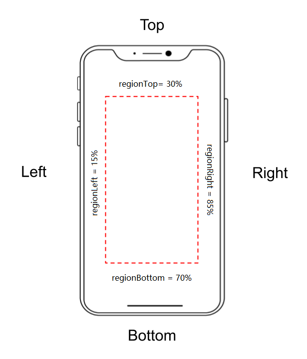

# CameraEnhancer Class

The main class of `DynamsoftCameraEnhancer`. It contains APIs that enable user to:

- Implement basic camera control like open, close, change resolution, etc.
- Get frames from the video streaming.
- Enable advanced features including:
  - Frame filtering by sharpness
  - Frame filtering by sensor
  - Enhanced focus
  - Frame cropping
  - Auto zoom
  - Smart torch control

```objc
@interface DynamsoftCameraEnhancer:NSObject
```

## Initialization Methods Summary

| Method | Description |
| ------ | ----------- |
| [`initWithView`](#initwithview) | Initialize the camera enhancer with the camera view |
| [`initLicense`](#initlicense) | Set product key and activate the SDK. |
| [`getVersion`](#getversion) | Get the SDK version. |
| [`cameraView`](#cameraview) | Bind a `DCECameraView` to the camera enhancer. |

## Basic Camera Control Methods Summary

| Method | Description |
| ------ | ----------- |
| [`getAllCameras`](#getallcameras) | Get all available cameras. This method returns a list of available camera IDs. |
| [`selectCameraWithPosition`](#selectcamerawithposition) | Select whether to use front-facing camera or back-facing camera. |
| [`getCameraPosition`](#getcameraposition) | Returns whether the front-facing camera or back-facing camera is selected. |
| [`selectCamera`](#selectcamera) | Select a camera from the camera list with the camera ID. |
| [`getSelectedCamera`](#getselectedcamera) | Get the camera ID of the current selected camera. |
| [`getCameraState`](#getcamerastate) | Get the state of the current selected camera. |
| [`open`](#open) | Turn on the current selected camera. |
| [`close`](#close) | Turn off the current selected camera. |
| [`pause`](#pause) | Pause the current selected  camera. |
| [`resume`](#resume) | Resume the current selected camera. |
| [`turnOnTorch`](#turnontorch) | Turn on the torch. |
| [`turnOffTorch`](#turnofftorch) | Turn off the torch. |
| [`getFrameRate`](#getframerate) | Get the current frame rate. |
| [`setResolution`](#setresolution) | Set the resolution to the input value (if the input value is available for the device). |
| [`getResolution`](#getresolution) | Get the current resolution. |
| [`setZoom`](#setzoom) | Set the zoom factor. Once **setZoom** is triggered and approved, the zoom factor of the activated camera will immediately become the input value. |
| [`getMaxZoomFactor`](#getmaxzoomfactor) | Get the maximum available zoom factor. |
| [`autoZoomRange`](#autozoomrange) | The property for getting/setting the range of auto zoom. |
| [`setFocus`](#setfocus) | Set the focus position (value range from 0.0f to 1.0f) and trigger a focus at the configured position. |
| [`setFocus(subsequentFocusMode)`](#setfocussubsequentfocusmode) | Trigger a focus at the targeting point and set the subsequent focus mode after focused.  |
| [`setScanRegion`](#setscanregion) | Set the **scanRegion** with a [`iRegionDefinition`]({{ site.ios-api-auxiliary }}region-definition.html) value. The frame will be cropped according to the scan region. |
| [`getScanRegion`](#getscanregion) | Get the scan region. |
| [`scanRegionVisible`](#scanregionvisible) | Set whether to display the **scanRegion** on the UI. |
| [`setCameraStateListener`](#setcamerastatelistener) | Add a `DCECameraStateListener` to receive notification when the camera state changes. |
| [`setFrameRate`](#setframerate) | **Deprecated, will be removed in v3.0**. Set the frame rate to the input value (if the input value is available for the device). |

## Frame Acquiring Methods Summary

| Method | Description |
| ------ | ----------- |
| [`getFrameFromBuffer`](#getframefrombuffer) | Get the latest frame from the buffer. The boolean value determines whether the fetched frame will be removed from the buffer. |
| [`addListener`](#addlistener) | Add a listener to the camera enhancer instance. |
| [`removeListener`](#removelistener) | Remove a previously added listener from the camera enhancer instance. |
| [`takePhoto`](#takephoto) | Take a photo from the camera and save the image in the memory. |

## Enhanced Features Methods Summary

| Method | Description |
| ------ | ----------- |
| [`enableFeatures`](#enablefeatures) | Enable camera enhancer features by inputting [`EnumEnhancerFeatures`]({{site.mobile-enum}}enum-enhancer-features.html?lang=objc,swift) values. |
| [`disableFeatures`](#disablefeatures) | Disable camera enhancer features by inputting [`EnumEnhancerFeatures`]({{site.mobile-enum}}enum-enhancer-features.html?lang=objc,swift) values. |
| [`isFeatureEnabled`](#isfeatureenabled) | Check whether the input features are enabled. |

## Advanced Camera Control Methods Summary

| Method | Description |
| ------ | ----------- |
| [`updateAdvancedSettingsFromFile`](#updateadvancedsettingsfromfile) | Update the advanced camera controlling and video streaming processing parameters. This method enables you to update settings via a JSON file from the storage. |
| [`updateAdvancedSettingsFromString`](#updateadvancedsettingsfromstring) | Update the advanced camera controlling and video streaming processing parameters. This method enables you to update settings via a JSON string. |

&nbsp;

## Initialization Methods Details

### initWithView

Initialize the camera enhancer with the `DCECameraView`.

```objc
- (instancetype)initWithView:(DCECameraView *)view;
```

**Return Value**

The instance of DynamsoftCameraEnhancer.

**Code Snippet**

<div class="sample-code-prefix"></div>
>- Objective-C
>- Swift
>
>1. 
```objc
_dce = [[DynamsoftCameraEnhancer alloc] initWithView:_dceView];
```
2. 
```swift
let dce = DynamsoftCameraEnhancer.init(view: dceCameraView)
```

&nbsp;

### initLicense

Set product key and activate the SDK. It is recommended to initialize the license in `AppDelegate.m`.

```objc
+(void)initLicense:(NSString*)license verificationListener:(id) verificationListener;
```

**Parameters**

`[in] license`: The product key.  
`[in out] verificationListener`: The listener that handles callback when the license server returns. See also [`DCELicenseVerificationListener`]({{ site.ios-api-auxiliary }}protocol-licenselistener.html).

**Code Snippet**

<div class="sample-code-prefix"></div>
>- Objective-C
>- Swift
>
>1. 
```objc
[DynamsoftCameraEnhancer initLicense:@"Put your license here" verificationDelegate: self];
- (void)DCELicenseVerificationCallback:(bool)isSuccess error:(NSError *)error{
}
```
2. 
```swift
DynamsoftCameraEnhancer.initLicense("Put your license here", verificationDelegate: self)
func dceLicenseVerificationCallback(_ isSuccess: Bool, error: Error?) {
}
```

&nbsp;

### getVersion

Get the SDK version of Dynamsoft Camera Enhancer.

```objc
- (NSString*)getVersion;
```

**Return Value**

A string value that stands for the Camera Enhancer SDK version.

**Code Snippet**

<div class="sample-code-prefix"></div>
>- Objective-C
>- Swift
>
>1. 
```objc
NSString* version = [_dce getVersion];
```
2. 
```swift
let version = dce.getVersion()
```

&nbsp;

### cameraView

Bind a `DCECameraView` to the camera enhancer.

```objc
@property (strong, nonatomic) DCECameraView cameraView; 
```

**Code Snippet**

<div class="sample-code-prefix"></div>
>- Objective-C
>- Swift
>
>1. 
```objc
_dceView = [[DCECameraView alloc] initWithFrame:self.view.bounds]
[_dce setCameraView:_dceView];
```
2. 
```swift
let dceView = DCECameraView.init(frame self.view.bounds)
dce.cameraView = dceView
```

&nbsp;

## Basic Camera Control Methods Details

### getAllCameras

Get the IDs of all available cameras.

```objc
- (NSArray*)getAllCameras;
```

**Return Value**

An NSArray that includes all available cameras. Users can clearly read whether the camera is front-facing, back-facing, or external from the cameraID.

**Code Snippet**

<div class="sample-code-prefix"></div>
>- Objective-C
>- Swift
>
>1. 
```objc
NSArray<NSString*>* allCameras = [_dce getAllCameras];
```
2. 
```swift
let allCameraList = dce.getAllCameras()
```

&nbsp;

### selectCameraWithPosition

Select the camera position (front-facing or back-facing).

```objc
- (void)selectCameraWithPosition:(EnumCameraPosition)position error:(NSError * _Nullable * _Nullable)error;
```

**Parameters**

`[in] cameraPosition`: An `EnumCameraPosition` value that indicates front-facing or back-facing camera.  
`[in out] error`: The error occurs when the input value is invalid. You may specify nil for this parameter if you do not want the error information.

**Code Snippet**

<div class="sample-code-prefix"></div>
>- Objective-C
>- Swift
>
>1. 
```objc
[_dce selectCameraWithPosition:EnumCameraPositionBack error: &error];
```
2. 
```swift
dce.selectCamera(with: EnumCameraPosition.back, error: nil)
```

&nbsp;

### getCameraPosition

Returns whether the front-facing camera or back-facing camera is selected.

```objc
- (EnumCameraPosition) getCameraPosition;
```

**Return Value**

An `EnumCameraPosition` value that indicates front-facing or back-facing camera.

**Code Snippet**

<div class="sample-code-prefix"></div>
>- Objective-C
>- Swift
>
>1. 
```objc
EnumCameraPosition cameraPosition = [_dce getCameraPosition];
```
2. 
```swift
let cameraPosition = dce.getCameraPosition()
```

&nbsp;

### selectCamera

Select camera by `cameraID`. The camera will be selected and further camera control settings will be applied to this camera. When the selected camera is changed via this method, the settings will be inherited by the newly selected camera.

```objc
- (void)selectCamera:(NSString*)cameraId error:(NSError * _Nullable * _Nullable)error;
```

**Parameters**

`[in] cameraID`: A `String` value that listed in the `cameraIDList` returned by `getAllCameras`. The method will have no effects if the input value does not exist in the `cameraIDList`.  
`[in out] error`: The error occurs when the input value is invalid. You may specify nil for this parameter if you do not want the error information.

**Code Snippet**

<div class="sample-code-prefix"></div>
>- Objective-C
>- Swift
>
>1. 
```objc
[_dce selectCamera:@"BACK_FACING_CAMERA" error: &error];
```
2. 
```swift
dce.selectCamera("BACK_FACING_CAMERA", error: &error)
```

**Remarks**

- There is always a back-facing camera be defined as a default camera. If the user doesn't select any camera via `selectCamera`, the default camera will be considered as the selected camera.
- If there is no opened camera, the method `selectCamera` will not open any camera.
- If there is an opened camera and the opened camera's ID exactly equals the input ID, the method `selectCamera` will make no changes.
- If there is an opened camera and the opened camera's ID is different from the input ID, the method `selectCamera` will close the currently opened camera and then open a new camera by the input ID.

&nbsp;

### getSelectedCamera

Get the ID of the currently selected camera.

```objc
- (NSString*)getSelectedCamera;
```

**Return Value**

The ID of the current selected camera.

**Code Snippet**

<div class="sample-code-prefix"></div>
>- Objective-C
>- Swift
>
>1. 
```objc
NSString* cameraID = [_dce getSelectedCamera];
```
2. 
```swift
let selectedCamera = dce.getSelectedCamera()
```

&nbsp;

### getCameraState

Get the state of the currently selected camera.

```objc
- (EnumCameraState*)getCameraState;
```

**Return Value**

One of the preset camera state in Enumeration [`EnumCameraState`]({{site.mobile-enum}}enum-camera-state.html?lang=objc,swift).

**Code Snippet**

<div class="sample-code-prefix"></div>
>- Objective-C
>- Swift
>
>1. 
```objc
EnumCameraState state = [_dce getCameraState];
```
2. 
```swift
let cameraState = dce.getCameraState()
```

&nbsp;

### open

- Turn on the selected camera if a camera has been selected via `selectCamera`.
- Turn on the default camera if no camera is selected via `selectCamera`.

```objc
- (void)open;
```

**Code Snippet**

<div class="sample-code-prefix"></div>
>- Objective-C
>- Swift
>
>1. 
```objc
[_dce open];
```
2. 
```swift
dce.open()
```

&nbsp;

### close

- Turn off the selected camera if a camera has been selected via `selectCamera`.
- Turn off the default camera if no camera is selected via `selectCamera`.

```objc
- (void)close;
```

**Code Snippet**

<div class="sample-code-prefix"></div>
>- Objective-C
>- Swift
>
>1. 
```objc
[_dce close];
```
2. 
```swift
dce.close()
```

&nbsp;

### pause

- Pause the selected camera if a camera has been selected via `selectCamera`.
- Pause the default camera if no camera is selected via `selectCamera`.

```objc
- (void)pause;
```

**Code Snippet**

<div class="sample-code-prefix"></div>
>- Objective-C
>- Swift
>
>1. 
```objc
[_dce pause];
```
2. 
```swift
dce.pause()
```

**Remarks**

If the `pause` method is triggered:

- The camera UI will be stopped on the last frame captured before you `pause` the camera.
- The camera is still open.
- The video streaming input is not stopped.
- DCE video buffer will continue appending frames.

&nbsp;

### resume

- Resume the selected camera if a camera has been selected via `selectCamera`.
- Resume the default camera if no camera is selected via `selectCamera`.

```objc
- (void)resume;
```

**Code Snippet**

<div class="sample-code-prefix"></div>
>- Objective-C
>- Swift
>
>1. 
```objc
[_dce resume];
```
2. 
```swift
dce.resume()
```

&nbsp;

### turnOnTorch

Turn on the torch (if the torch of the mobile device is available).

```objc
- (void)turnOnTorch;
```

**Code Snippet**

<div class="sample-code-prefix"></div>
>- Objective-C
>- Swift
>
>1. 
```objc
[_dce turnOnTorch];
```
2. 
```swift
dce.turnOnTorch()
```

&nbsp;

### turnOffTorch

Turn off the torch.

```objc
- (void)turnOffTorch;
```

**Code Snippet**

<div class="sample-code-prefix"></div>
>- Objective-C
>- Swift
>
>1. 
```objc
[_dce turnOffTorch];
```
2. 
```swift
dce.turnOffTorch()
```

&nbsp;

### getFrameRate

Get the current frame rate.

```objc
- (NSInteger)getFrameRate;
```

**Return Value**

The current frame rate.

**Code Snippet**

<div class="sample-code-prefix"></div>
>- Objective-C
>- Swift
>
>1. 
```objc
NSInteger frameRate = [_dce getFrameRate];
```
2. 
```swift
let frameRate = dce.getFrameRate()
```

&nbsp;

### setResolution

Input one of the preset resolution value in Enumeration `Resolution`. The camera enhancer will try to set the resolution to the target value or the closest available value below the target value.

```objc
- (Void)setResolution:(Resolution)resolution;
```

**Parameters**

`[in] resolution`: One of the int value that preset in Enumeration [`EnumResolution`]({{site.mobile-enum}}enum-resolution.html?lang=objc,swift).

**Code Snippet**

<div class="sample-code-prefix"></div>
>- Objective-C
>- Swift
>
>1. 
```objc
[_dce setResolution:EnumRESOLUTION_1080P];
```
2. 
```swift
dce.setResolution(EnumResolution.EnumRESOLUTION_1080P)
```

&nbsp;

### getResolution

Get the current resolution.

```objc
- (NSString*)getResolution;
```

**Return Value**

The size of the current resolution.

**Code Snippet**

<div class="sample-code-prefix"></div>
>- Objective-C
>- Swift
>
>1. 
```objc
NSString* resolution = [_dce getResolution];
```
2. 
```swift
let resolution = dce.getResolution()
```

&nbsp;

### setZoom

Set the zoom factor. Once `setZoom` is triggered and approved, the zoom factor of the activated camera will immediately become the input value.

```objc
- (Void)setZoom:(CGFloat)factor
```

**Parameters**

`[in] factor`: The target zoom factor.

**Code Snippet**

<div class="sample-code-prefix"></div>
>- Objective-C
>- Swift
>
>1. 
```objc
[_dce setZoom:3.0f];
```
2. 
```swift
dce.setZoom(3.0)
```

&nbsp;

### getMaxZoomFactor

Get the maximum available zoom factor.

```objc
- (CGFloat)getMaxZoomFactor;
```

**Return Value**

A **CGFloat** value that indicates the maximum available zoom factor of the device.

**Code Snippet**

<div class="sample-code-prefix"></div>
>- Objective-C
>- Swift
>
>1. 
```objc
CGFloat maxZoomFactor = [_dce getMaxZoomFactor];
```
2. 
```swift
let maxZoomFactor = dce.getMaxZoomFactor()
```

&nbsp;

### autoZoomRange

The property for getting/setting the range of auto zoom.

```objc
@property (nonatomic, assign) UIFloatRange autoZoomRange;
```

**Code Snippet**

<div class="sample-code-prefix"></div>
>- Objective-C
>- Swift
>
>1. 
```objc
[_dce setAutoZoomRange:UIFloatRangeMake(1.5,4)];
UIFloatRange currentZoomRange = [_dce autoZoomRange];
```
2. 
```swift
dce.autoZoomRange = UIFloatRange(minimum:1.5, maximum: 4)
let currentZoomRange = dce.autoZoomRange()
```

&nbsp;

### setFocus

Set the focus position (value range from 0.0f to 1.0f) and trigger a focus at the configured position.

```objc
- (Void)setFocus:(CGPoint)focusPosition;
```

**Parameters**

`[in] focusPosition`: A CGPoint that stores the x and y coordinate of the targeting focus position.

**Code Snippet**

<div class="sample-code-prefix"></div>
>- Objective-C
>- Swift
>
>1. 
```objc
CGPoint focusPoint = {0.4, 0.5};
[_dce setFocus:focusPoint];
```
2. 
```swift
let focusPoint = CGPoint(x:0.4, y:0.5)
dce.setFocus(focusPoint)
```

&nbsp;

### setFocus(subsequentFocusMode)

Trigger a focus at the targeting point and set the subsequent focus mode after focused.

```objc
- (Void)setFocus:(CGPoint)focusPosition subsequentFocusMode:(EnumFocusMode)subsequentFocusMode; 
```

**Parameters**

`[in] focusPosition`: A `CGPoint` indicates the interest area.
`[in] subsequentFocusMode`: If you set the focus mode to `FM_LOCKED`, the focallength will be lock after the focus. Otherwise, the continuous auto focus that control by the hardware is still enabled.

**Code Snippet**

<div class="sample-code-prefix"></div>
>- Objective-C
>- Swift
>
>1. 
```objc
CGPoint focusPoint = {0.4, 0.5};
[_dce setFocus:focusPoint subsequentFocusMode:EnumFocusMode.FM_LOCKED];
```
2. 
```swift
let focusPoint = CGPoint(x:0.4, y:0.5)
dce.setFocus(focusPoint, subsequentFocusMode:EnumFocusMode.FM_LOCKEDD)
```

&nbsp;

### setScanRegion

Specify the `scanRegion`. The DCEFrames will be cropped according to the `scanRegion` before they are stored in the video buffer.

```objc
- (void)setScanRegion:(RegionDefinition)scanRegion error:(NSError * _Nullable)error;
```

**Parameters**

`[in] scanRegion`: Use a [`iRegionDefinition`]({{ site.ios-api-auxiliary }}region-definition.html) value to specify the scan region. The parameter will be optimized to the maximum or minimum available value if the input parameter is out of range. For more information, please view [`iRegionDefinition`]({{ site.ios-api-auxiliary }}region-definition.html).  
`[in out] error`: The error occurs when the region parameters are invalid. You may specify nil for this parameter if you do not want the error information.

<div align="center">
    <p></p>
    <p>How to set scan region</p>
</div>

**Code Snippet**

<div class="sample-code-prefix"></div>
>- Objective-C
>- Swift
>
>1. 
```objc
iRegionDefinition* scanRegion = [[iRegionDefinition alloc] init];
scanRegion.regionTop = 25;
scanRegion.regionBottom = 75;
scanRegion.regionLeft = 25;
scanRegion.regionRight = 75;
scanRegion.regionMeasuredByPercentage = 1
[_dce setScanRegion:scanRegion error: &error];
```
2. 
```swift
let scanRegion = iRegionDefinition()
scanRegion.regionTop = 25
scanRegion.regionBottom = 75
scanRegion.regionLeft = 25
scanRegion.regionRight = 75
scanRegion.regionMeasuredByPercentage = 1
dce.setScanRegion(scanRegion, error: &error)
```

**Remarks**

- The region definition defines the region on the **camera view**. For each value of the class [`iRegionDefinition`]({{ site.ios-api-auxiliary }}region-definition.html):
  - The `regionTop` is the distance between the **top** of the scan region and the **top** of the video frame.
  - The `regionBottom` is the distance between the **bottom** of the scan region and the **top** of the video frame.
  - The `regionLeft` is the distance between the **left** of the scan region and the **left** of the video frame.
  - The `regionRight` is the distance between the **right** of the scan region and the **left** of the video frame.

- When you trigger `setScanRegion`, the enhancer feature [`EF_FAST_MODE`](#enablefeatures) will be disabled.
- You will still get the original [`DCEFrame`]({{ site.ios-api-auxiliary }}dceframe.html) from [`FrameOutputCallback`]({{ site.ios-api-auxiliary }}protocol-dceframelistener.html) and cropped [`DCEFrame`]({{ site.ios-api-auxiliary }}dceframe.html) from [`getFrameFromBuffer`](#getframefrombuffer). The `cropRegion` of [`DCEFrame`]({{ site.ios-api-auxiliary }}dceframe.html) will be configured based on the **scanRegion** when `setScanRegion` is triggered.
- When you trigger `setScanRegion`, the [`scanRegionVisible`](#scanregionvisible) will be set to true automatically. If you don't want to display the **scanRegion** on the UI, please set the [`scanRegionVisible`](#scanregionvisible) to false manually.

&nbsp;

### getScanRegion

```objc
- (iRegionDefinition) getScanRegion
```

**Return Value**

The return value of `getScanRegion` is always the actual parameter of the `scanRegion`, which might be different from the user input parameter. If `scanRegion` is not configured or the method `setScanRegion` is not approved, the return value will be null.

**Code Snippet**

<div class="sample-code-prefix"></div>
>- Objective-C
>- Swift
>
>1. 
```objc
iRegionDefinition* myScanRegion = [[iRegionDefinition alloc] init];
myScanRegion = [_dce getScanRegion];
```
2. 
```swift
let scanRegion = iRegionDefinition()
scanRegion = dce.getScanRegion()
```

&nbsp;

### setCameraStateListener

Set a `DCECameraStateListener` to receive notifications when the camera state changes.

```objc
- (void) setCameraStateListener:(nonnull id<DCECameraStateListener>)listener;
```

**Parameters**

`[in] listener`: A `DCECameraStateListener` object.

**Code Snippet**

<div class="sample-code-prefix"></div>
>- Objective-C
>- Swift
>
>1. 
```objc
@interface ViewController ()<DCECameraStateListener>
- (void)configurationDCE{
   [_dce setCameraStateListener:self];
}
- (void)stateChangeCallback:(EnumCameraState)state{
   // Add your code to do when camera state changes.
}
```
2. 
```swift
class ViewController: UIViewController,DCECameraStateListener{
   func configurationDCE(){
          dce.setCameraStateListener(self)
   }
   func stateChangeCallback(EnumCameraState currentState){
          // Add your code to do when camera state changes.
   }
}
```

### scanRegionVisible

> Deprecated. Will be removed in v3.0.

Set whether to display the **scanRegion** on the UI. The default value of the property is false. When the property value is set to true, the scan region will be drawn on the UI. The **scanRegion** will not be displayed if its value is null

```objc
@property (assign, nonatomic) BOOL scanRegionVisible;
```

&nbsp;

### setFrameRate

> Deprecated. Will be removed in v3.0.

Set the frame rate to the input value (if the input value is available for the device).

```objc
- (void)setFrameRate:(NSInteger)frameRate;
```

**Parameters**

`[in] frameRate`: An int value that refers to the target frame rate.  

**Code Snippet**

<div class="sample-code-prefix"></div>
>- Objective-C
>- Swift
>
>1. 
```objc
[_dce setFrameRate:15];
```
2. 
```swift
dce.setFrameRate(15)
```

**Remarks**

The available frame rate setting threshold is always intermittent, which means the input value might not match any available frame rate threshold. If the input value is below the lowest available threshold, the frame rate will be set to the lowest available threshold. If the input value is above the lowest available threshold but still does not match any threshold, the frame rate will be set to the highest available threshold below the input value.

&nbsp;

## Frame Acquiring Methods Details

### getFrameFromBuffer

Get the latest frame from the buffer. The boolean value determines whether the fetched frame will be removed from the buffer.

```objc
- (DCEFrame*)getFrameFromBuffer:(BOOL)keep;
```

**Parameters**

`[in] Keep`: If set to `true`, the frame will be kept in the video buffer. Otherwise, it will be removed from the video buffer.

**Return Value**

The latest frame in the video buffer.

**Code Snippet**

<div class="sample-code-prefix"></div>
>- Objective-C
>- Swift
>
>1. 
```objc
dceFrame = [_dce getFrameFromBuffer:true];
```
2. 
```swift
let dceFrame = dce.getFrameFromBuffer()
```

&nbsp;

### addListener

Add a listener to the `CameraEnhancer` instance. This method will have no effect if the same listener is already added.

```objc
- (void)addListener:(nonnull id<DCEFrameListener>)listener;
```

**Parameters**

`[in] listener`: An object of `DCEFrameListener`. Its callback method `frameOutputCallback` will be available for users to make further operations on the captured video frame.

**Code Snippet**

<div class="sample-code-prefix"></div>
>- Objective-C
>- Swift
>
>1. 
```objc
[_dce addListener:self];
```
2. 
```swift
dce.addListener(self)
```

&nbsp;

### removeListener

Remove a previously added listener from the `CameraEnhancer` instance. This method will have no effect if there is no listener exists in `CameraEnhancer` instance.

```objc
- (void)removeListener:(nonnull id<DCEFrameListener>)listener;
```

**Parameters**

`[in] listener`: The input listener will be removed from the Camera Enhancer instance.

**Code Snippet**

<div class="sample-code-prefix"></div>
>- Objective-C
>- Swift
>
>1. 
```objc
[_dce removeListener:self];
```
2. 
```swift
dce.removeListener(self)
```

&nbsp;

### takePhoto

Take a photo from the camera and save the image in the memory. The photo will be captured and users can receive the captured photo via [`photoOutputCallback`](../auxiliary-api/protocol-dcephotolistener.md#photooutputcallback).

```objc
- (void)takePhoto:(nonnull id<DCEPhotoListener>)listener API_AVAILABLE(ios(11.0));
```

**Parameters**

`[in] listener`: An instance of [`DCEPhotoListener`](../auxiliary-api/protocol-dcephotolistener.md).

**Code Snippet**

<div class="sample-code-prefix"></div>
>- Objective-C
>- Swift
>
>1. 
```objc
@interface ViewController ()<DCEPhotoListener>
- (void)configurationDCE(){
   [_dce takePhoto:self]
}
- (void)photoOutputCallback:(NSData *)jpegBytes{
   // Add your code to execute when photo is captured.
}
```
2. 
```swift
class ViewController: UIViewController, DCEPhotoListener {
   func configurationDCE(){
          dce.takePhoto()
   }
   func photoOutputCallback(_ jpegByte: Data){
          // Add your code to execute when photo is captured.
   }
}
```

&nbsp;

## Enhanced Features Methods Details

### enableFeatures

Enable camera enhancer features by inputting [`EnumEnhancerFeatures`]({{site.mobile-enum}}enum-enhancer-features.html?lang=objc,swift) value. When the license verification is failed, the enabled features will be recorded but not actived. Once a valid license is verified, the features you enabled will be recovered.

```objc
- (void)enableFeatures:(EnumEnhancerFeatures)features  error:(NSError * _Nullable * _Nullable)error;
```

**Parameters**

`[in] enhancerFeatures`: The combined value of [`EnumEnhancerFeatures`]({{site.mobile-enum}}enum-enhancer-features.html?lang=objc,swift).  
`[in out] error`: The error occurs when the license is invalid. You may specify nil for this parameter if you do not want the error information.

**Code Snippet**

<div class="sample-code-prefix"></div>
>- Objective-C
>- Swift
>
>1. 
```objc
[_dce enableFeatures:EnumFRAME_FILTER error: &error];
```
2. 
```swift
dce.enableFeatures(EnumEnhancerFeature.EnumFRAME_FILTER.rawValue, error: &error)
```

**Remarks**

The `EnumEnhancerFeatures` members:

|  Members | Value |
| -------- | ----- |
| `EnumFRAME_FILTER` | 0x01 |
| `EnumSENSOR_CONTROL` | 0x02 |
| `EnumENHANCED_FOCUS` | 0x04 |
| `EnumFAST_MODE` | 0x08 |
| `EnumAUTO_ZOOM` | 0x10 |
| `EnumSMART_TORCH` | 0x20 |

The enable action will not be approved if the license is invalid. If your input values include the features that have been already enabled, these features will keep the enabled status.

&nbsp;

### disableFeatures

Disable camera enhancer features by inputting [`EnumEnhancerFeatures`]({{site.mobile-enum}}enum-enhancer-features.html?lang=objc,swift) values.

```objc
- (void)disableFeatures:(EnumEnhancerFeatures)features;
```

**Parameters**

`[in] enhancerFeatures`: The combined value of [`EnumEnhancerFeatures`]({{site.mobile-enum}}enum-enhancer-features.html?lang=objc,swift).  

**Code Snippet**

<div class="sample-code-prefix"></div>
>- Objective-C
>- Swift
>
>1. 
```objc
[_dce disableFeatures:EnumFRAME_FILTER];
```
2. 
```swift
dce.disableFeatures(EnumEnhancerFeature.EnumFRAME_FILTER.rawValue)
```

**Remarks**

You can still disable the features even if the license is invalid. If your input values include the features that are not enabled, these features will keep the disabled status.

&nbsp;

### isFeatureEnabled

Check whether the input features are enabled.

```objc
- (BOOL)isFeatureEnabled:(EnumEnhancerFeatures)features;
```

**Parameters**

`[in] enhancerFeatures`: The combined value of [`EnumEnhancerFeatures`]({{site.mobile-enum}}enum-enhancer-features.html?lang=objc,swift).

**Return Value**

A BOOL value refers to whether all the features you input are enabled.

- `True`: All the features you input are enabled.  
- `False`: There is at least one feature is not enabled among your input values.

**Code Snippet**

<div class="sample-code-prefix"></div>
>- Objective-C
>- Swift
>
>1. 
```objc
BOOL featureEnabled = [_dce isFeatureEnabled:EnumFRAME_FILTER];
```
2. 
```swift
let featureEnabled = dce.isFeatureEnabled(EnumEnhancerFeature.EnumFRAME_FILTER.rawValue)
```

**Remarks**

If the features you input are all enabled but don't cover all the enabled features, this method will still return `true`.

&nbsp;

## Advanced Camera Control Methods Details

### updateAdvancedSettingsFromFile

Update the advanced camera controlling and video streaming processing parameters. This method enables you to update settings via a JSON file from the storage.

```objc
- (void)updateAdvancedSettings:(NSString*)filePath error:(NSError * _Nullable * _Nullable)error;
```

**Parameters**

`[in] filePath`: The file path of the JSON file.  
`[in out] error`:  The error occurs when the JSON data is invalid. You may specify nil for this parameter if you do not want the error information.

**Code Snippet**

<div class="sample-code-prefix"></div>
>- Objective-C
>- Swift
>
>1. 
```objc
[_dce updateAdvancedSettingsFromFile:@"Put your JSON file path here." error: &error];
```
2. 
```swift
dce.updateAdvancedSettings(fromFile: "Put your JSON file path here.", error: &error)
```

**Remarks**

You might need permission authority to enable the Camera Enhancer to read the file in your mobile storage.

&nbsp;

### updateAdvancedSettingsFromString

Update the advanced camera controlling and video streaming processing parameters. This method enables you to update settings via a JSON string.

```objc
- (void)updateAdvancedSettings:(NSString*)params error:(NSError * _Nullable * _Nullable)error;
```

**Parameters**

`[in] jsonString`: A stringified JSON data.  
`[in out] error`: The error occurs when the JSON data is invalid. You may specify nil for this parameter if you do not want the error information.

**Code Snippet**

<div class="sample-code-prefix"></div>
>- Objective-C
>- Swift
>
>1. 
```objc
[_dce updateAdvancedSettingsFromString:@"Put your stringified JSON data here." error: &error];
```
2. 
```swift
dce.updateAdvancedSettings(from: "Put your stringified JSON data here.", error: &error)
```

&nbsp;

The advanced settings are as follow:

| Parameter Name | Type | Description |
| -------------- | ---- | ----------- |
| [`focalLength`](#focallength) | *float* | Set the fixed focal length. |
| [`autoFocusInterval`](#autofocusinterval) | *int* | Set the time interval of the auto focus. |
| [`autoFocusTerminateTime`](#autofocusterminatetime) | *int* | Set the minimum terminate time of auto focus. |
| [`sensorControlSensitivity`](#sensorcontrolsensitivity) | *int* | Set the sensitivity of the mobile sensor. |
| [`FastMode`](#fastmode) | *JSON data* | Set a group of crop regions. |
| [`ISO & ExposureTime`](#iso--exposuretime) | *JSON data* | Set the ISO and exposure time. |

#### focalLength

Set the fixed focal length with a float value. When this parameter is configured, the other focus methods and parameters will be disbaled and the focal length will be fixed. Users can reset the focalLength to -1 to disable the fixed focus settings. The closer to the 0, the further the focalLength will be.

| Value Type | Value Range | Default Value |
| ---------- | ----------- | ------------- |
| *int* | [0,1] | -1 |

#### autoFocusInterval

Set the time interval of the auto-focus with an int value.

| Value Type | Value Range | Default Value |
| ---------- | ----------- | ------------- |
| *int* | [0,0x7fffffff] | 3000(ms) |

#### autoFocusTerminateTime

The minimum termination time of the auto-focus with an int value.

| Value Type | Value Range | Default Value |
| ---------- | ----------- | ------------- |
| *int* | [0,0x7fffffff] | 500(ms) |

#### sensorControlSensitivity

Set the sensitivity of the mobile sensor with an int value. A lower input value results in a higher sensitivity.

| Value Type | Value Range | Default Value |
| ---------- | ----------- | ------------- |
| *int* | [0,0x7fffffff] | 50 |

#### FastMode

The fast-mode parameters store four groups of frame cropping parameters. The cropping parameters will be implemented periodically when the fast mode is enabled. You can use the default cropping region settings or update your personalized crop regions via a JSON string or file.

Example:

```json
"FastMode": {
    "cropRegions": [{
        "top": 0,
        "right": 100,
        "bottom": 100,
        "left": 0
    },
    {
        "top": 25,
        "right": 100,
        "bottom": 75,
        "left": 0
    },
    {
        "top": 25,
        "right": 75,
        "bottom": 75,
        "left": 25
    },
    {
        "top": 25,
        "right": 75,
        "bottom": 75,
        "left": 25
    }]
}
```

#### ISO & ExposureTime

Set the ISO and exposure time of the camera.

Example:

```json
{
    // The "value" and "timescale" will be generated to a CMTime object.
    "iOSExposureTime":{
        "value": 4,
        "timescale": 2,
    },
    "iso":30
}
```
